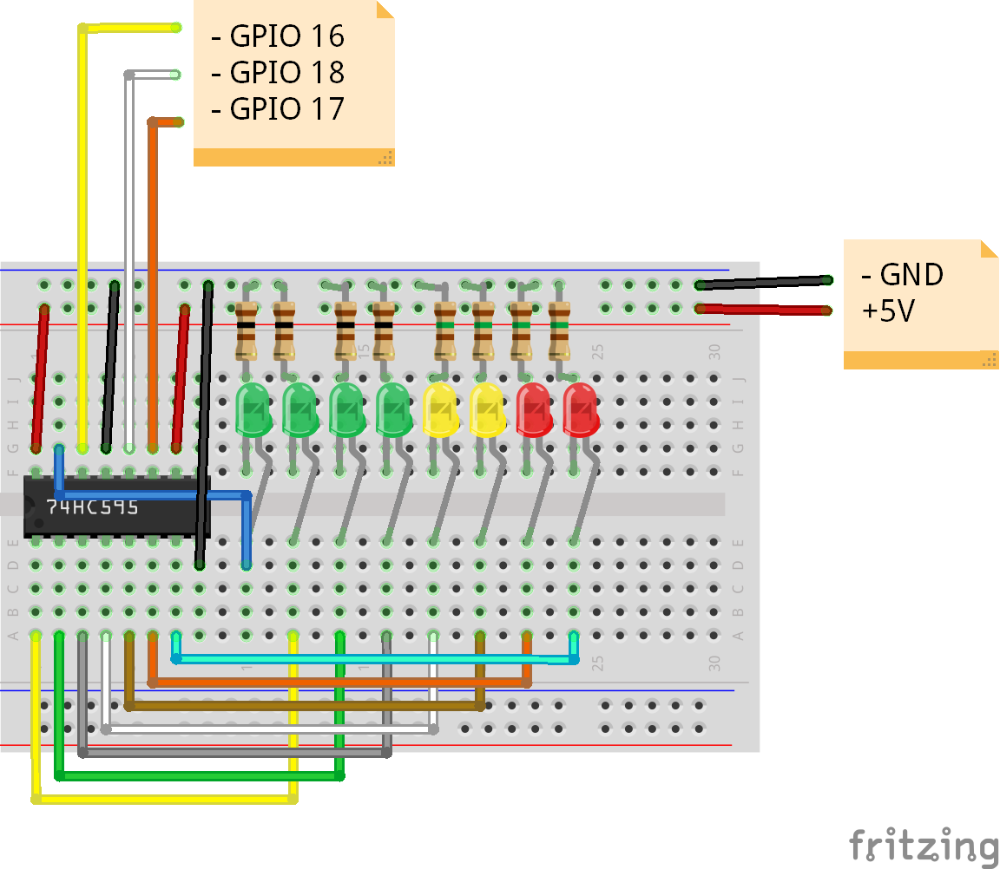

# Forza Horizon 4 LED tachometer
You can set in the Forza Horizon settings, to send telemetry through UDP packet to a defined ip and port. I write a program that recives all the UDP packets and get the RPM informations (current RPM, idle RPM, max RPM) and with them i represent the current RPM value with 8 leds through a shift register.

In action footage: https://www.youtube.com/watch?v=HXDwOsYU45Q

# Enable 'Data out' in Forza Horizon 4
Settings -> HUD and Gameplay -> DATA OUT set to 'ON' and set 'DATA OUT IP ADDRESS' and 'DATA OUT IP ADDRESS'

# Developed in
C++ with PlatformIO (VS Code)

# Used libraries
- AsyncUDP form (https://github.com/espressif/arduino-esp32)
- ShiftRegister74HC595 (https://github.com/Simsso/ShiftRegister74HC595)

# Wiring

# License
This project is released under the MIT license. See [LICENSE](LICENSE) for details.